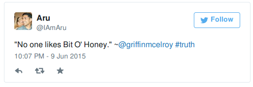
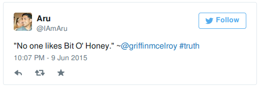

# ngTweet

Easily embed Twitter widgets into your Angular application! No more having to kludge together a Twitter script loader, or manage embed state on route/visibility change.

## Installation

```console
$ bower install ngtweet
```

Then include `ngtweet.js` or `ngtweet.min.js` in your markup and add `ngtweet` to your application's dependencies.  Your markup should look like this at the end:

```html
<!doctype html>
<html ng-app="myApp">
<head>
    <script src="//ajax.googleapis.com/ajax/libs/angularjs/1.4.1/angular.min.js"></script>
    <script src="bower_modules/ngtweet/dist/ngtweet.min.js"></script>
    <script type="text/javascript" charset="utf-8">
        var myApp = angular.module('myApp', ['ngtweet']);
    </script>
    ...
</head>
<body>
    ...
</body>
</html>
```

## Usage

There are two ways to embed a Twitter widget - with the source from Twitter (*embedded*), or via Tweet ID (*linked*).

### Embedded

Given the source for an embedded Tweet

```html
<blockquote class="twitter-tweet" lang="en"><p lang="en" dir="ltr">&quot;No one likes Bit O&#39; Honey.&quot; ~<a href="https://twitter.com/griffinmcelroy">@griffinmcelroy</a> <a href="https://twitter.com/hashtag/truth?src=hash">#truth</a></p>&mdash; Aru (@IAmAru) <a href="https://twitter.com/IAmAru/status/608455483507245059">June 10, 2015</a></blockquote>
<script async src="//platform.twitter.com/widgets.js" charset="utf-8"></script>
```

First, remove the `<script>` element from the markup.  Then, simply wrap it in a `<twitter-widget>` tag:

```html
<twitter-widget>
<blockquote class="twitter-tweet" lang="en"><p lang="en" dir="ltr">&quot;No one likes Bit O&#39; Honey.&quot; ~<a href="https://twitter.com/griffinmcelroy">@griffinmcelroy</a> <a href="https://twitter.com/hashtag/truth?src=hash">#truth</a></p>&mdash; Aru (@IAmAru) <a href="https://twitter.com/IAmAru/status/608455483507245059">June 10, 2015</a></blockquote>
</twitter-widget>
```

Load your app, and you get:



### Linked

Given a Tweet with ID '617749885933232128', simply add a `<twitter-widget>` tag to your markup with an attribute named `twitter-widget-id` specifying the Tweet ID.

```html
<twitter-widget twitter-widget-id="617749885933232128">
</twitter-widget>
```



## Contributing

Pull requests are welcomed!  The existing code follows John Papa's wonderful [Angular Style Guide](https://github.com/johnpapa/angular-styleguide). Run `gulp build` to generate the debug and minified JavaScript files, and then `gulp serve` to run the demo site to verify embeds work.  Please include the compiled code within the `dist/` directory with your PR.

## The Future (tm)

This is very much a young library, so I'm open to suggestions as to what direction it should go.  Currently, I'm planning on exposing other parts of the Twitter Widget library, including timelines, as well as adding eventing features, and promise support for render events.
